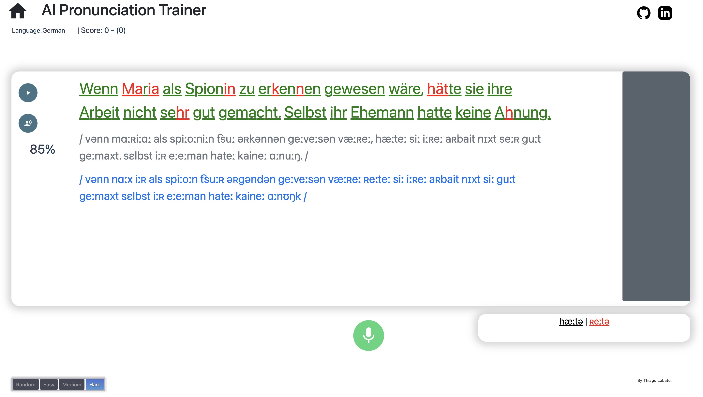

# AI Speaking Assistant
This tool uses AI to evaluate your pronunciation so you can improve it and be understood more clearly.  ). 



## Installation 
To run the program locally, you need to install the requirements and run the main python file:
```
pip install -r requirements.txt
python webApp.py
```
You'll also need ffmpeg, which you can download from here https://ffmpeg.org/download.html. On Windows, it may be needed to add the ffmpeg "bin" folder to your PATH environment variable. On Mac, you can also just run "brew install ffmpeg".

You should be able to run it locally without any major issues as long as you’re using a recent python 3.X version.  


## Motivation

Often, when we want to improve our pronunciation, it is very difficult to self-assess how good we’re speaking. Asking a native, or language instructor, to constantly correct us is either impractical, due to monetary constrains, or annoying due to simply being too boring for this other person. Additionally, they may often say “it sounds good” after your 10th try to not discourage you, even though you may still have some mistakes in your pronunciation. 

The AI pronunciation trainer is a way to provide objective feedback on how well your pronunciation is in an automatic and scalable fashion, so the only limit to your improvement is your own dedication. 

This project originated from a small program that I did to improve my own pronunciation.  When I finished it, I believed it could be a useful tool also for other people trying to be better understood, so I decided to make a simple, more user-friendly version of it.

